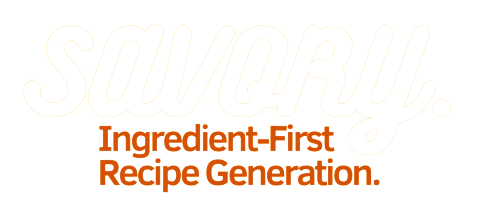

<h1 align="center">
  
</h1>
<h4 align="center">An Intuitive Way to Make The Most of Your Spare Groceries.</h4>

## Key Features

- **Ingredient-Based Recipe Searching:** Enter the main ingredient you have in your fridge, and discover recipes generated through quierying TheMealDB's extensive database.
- **Easy-to-Use Interface:** The user-friendly interface makes it simple to search for recipes and find more information on each result upon click.
- **Grid View of Search Results:** The search results are presented in a visually appealing grid format, allowing you to quickly scan and choose the recipe that catches your eye.
- **Recipe Details:** Clicking on a recipe card reveals additional details about the recipe, including the name, ingredients, instructions, and Youtube video.

## License

The Midnight Snack Recipe App is open-source software licensed under the [MIT License](https://opensource.org/licenses/MIT).
